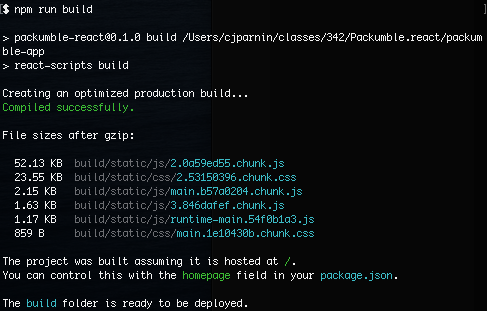

# Deploy

In this workshop, we'll cover the basics of provisioning a web server, packing a react application, and configuring and running a web server.

## Provisioning a server

### Creating an account

Before we get started, you need to make sure you have an [DigitalOcean account](https://m.do.co/c/1f1bebc48191). DigitalOcean is one of the cheapest and simpliest cloud providers available.

### Obtaining an API token

Once you have an account, from the dashboard, menu on the left-hand side, all the way on the bottom, you can click "API", under "Tokens/Keys" click the "Generate New Token" button. Make sure to assign Read and Write scope to the token, so you are allowed to create a virtual machine.

Once you have your API key, store this securely. Remember, you can always edit or delete a token.

### Using doctl

Install a command-line client for Digital Ocean, called [doctl](https://docs.digitalocean.com/reference/doctl/how-to/install/). 


When prompted, enter your api token.

```
$ doctl auth init
Please authenticate doctl for use with your DigitalOcean account. You can generate a token in the control panel at https://cloud.digitalocean.com/account/api/tokens

Enter your access token: 
```

Modify the following command to replace `<DROPLET-NAME>`, with your unity name. Run the command to create your first droplet.

```
doctl compute droplet create --region nyc1 --image ubuntu-20-04-x64 --size s-1vcpu-1gb <DROPLET-NAME>
```

This will create a 1GB droplet with a Ubuntu 20.04 image in the NYC1 region.

The result of the command will provide a droplet `ID` that you can use to get more information about your droplet.

```
$ doctl compute droplet create --region nyc1 --image ubuntu-20-04-x64 --size s-1vcpu-1gb cjparnin
ID           Name        Public IPv4    Private IPv4    Public IPv6    Memory    VCPUs    Disk    Region    Image                     VPC UUID    Status    Tags    Features         Volumes
272348345    cjparnin                                                  1024      1        25      nyc1      Ubuntu 20.04 (LTS) x64                new               droplet_agent    
```

For example, you get the IP address of the droplet with:

```
$ doctl compute droplet get <DROPLET-ID>
```

Confirm you can ping your droplet:

```
ping <IP4>
```

You can delete your droplet by running:

```
doctl compute droplet delete <DROPLET-ID>
```

### Configuring an SSH Key

You need a way to automatically connect to your server without having to manually authenicate each connection. We will create a pair of public/private keys for [authentication through ssh](https://www.ssh.com/ssh/public-key-authentication#sec-Asymmetric-Cryptography-Algorithms).

From your host machine, create a new public/private key pair, running the following command:

```bash | {type: 'command'}
ssh-keygen -t rsa -b 4096 -C "web-srv" -f web-srv -N ""
```

#### How do we use these keys?

The public key (🌐), is given away. While, the private key, is hidden away (*shh* 🤫, tell no one). 

In our case, the public key will be used to _authorize_ the private key for connections to the 🌍  `web-srv`. The private key will be stored in the 🎛️  `config-server`. It can then be used, for example, to make a ssh connection to the 🌍  `web-srv`, if needed (`ssh -i web-srv`).

#### Storing the public key in the hosting service ⚒️

Use of the the below clipboard commands or simply use `cat` to see and copy the content of public key. 💡  One nice trick is to use a copy utility to copy a file into your copy/paste buffer. Mac: `pbcopy < web-srv` | Windows: `clip < web-srv` | Linux: [Check out one of these options](https://superuser.com/a/288333/862331).

In your account, under
`Settings > Security > SSH Keys`, click [Add SSH Key] and paste the contents of your public key.

Run the following to confirm you can see the ssh key in the account.
```
doctl compute ssh-key list 
```

Now you can create droplets configured with ssh keys by adding the following option to your create command: `--ssh-keys <FINGERPRINT>`

## Deploying a web app

We will deploy the `Packumble.react` application to a server.

### Provision a web server

```
doctl compute droplet create --region nyc1 --image ubuntu-20-04-x64 --size s-1vcpu-1gb --ssh-keys <FINGERPRINT> <UNITYNAME-packumble>
```

Access server with 

ssh -i private.key root@<IP>

### Configuring a web server

We will need to install a few packages.

```
sudo apt-get update
sudo apt-get install nginx
sudo apt-get install nodejs npm
```

Setup web server server: https://github.com/CSC-WebApps/Packumble.react

### Preparing for production

* Running a process supervisor. Use `pm2` or `forever` to run process.
* Bundling an application

   Front-end frameworks, such as `react`, `angular`, and `vue` provide a way to package web applications into "Single Page Applications". 

   
* Push vs. pull. Ideally, the bundled version of code should be copied over to server instead of pulling code from github. Commands such as `rsync` and `scp` can be used to copy code to server.
* Configuring proper web server with nginx.

### Configuring nginx

General nginx configuration can be accessed in `/etc/nginx/nginx.conf`.

Site specific settings can be edited in: `/etc/nginx/sites-available/default`

```nginx|{type: 'file', user: 'root', path: '/etc/nginx/sites-available/default'}


server {
    listen 80;
    root /srv/Packumble.react/packumble-app/build/;
    index index.html index.htm;

    location / {
        try_files $uri /index.html;
    }
}
```

Test configuration and reload nginx service.

```bash|{type: 'command', failed_when: 'exitCode!=0'}
nginx -t && nginx -s reload
```

### Routing api

```
    location /api {
        proxy_pass http://localhost:3030;
        proxy_http_version 1.1;
        proxy_set_header Upgrade $http_upgrade;
        proxy_set_header Connection 'upgrade';
        proxy_set_header Host $host;
        proxy_cache_bypass $http_upgrade;
    }
```